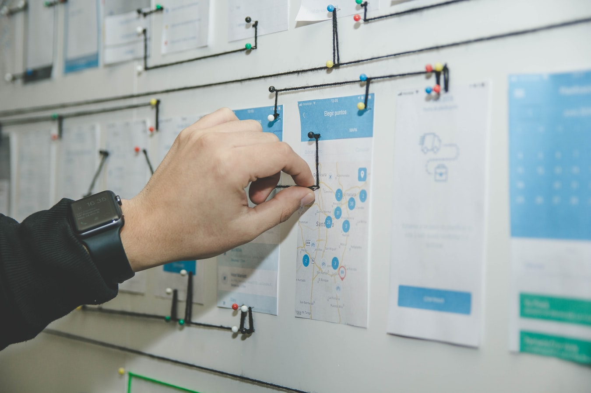
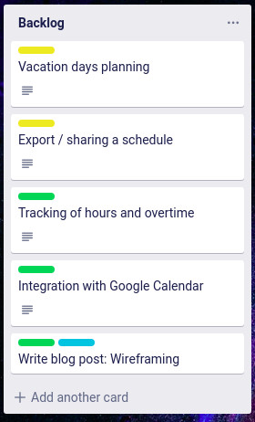
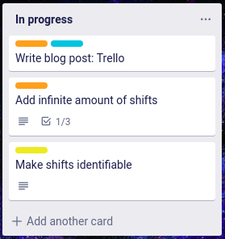
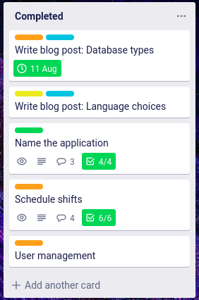

<figure>
	
</figure>

Apart from Evernote and regular paper notebooks I use Trello to manage my professional and private projects. You manage your project as a board.
Every board has lists (you can see them as categories or checklists) and you add cards to these lists. Cards are your individual tasks or steps you need to take in this project.

I’ll show you the setup I have for SimplyShift.

---

### Backlog

I add all my TODOs to this list. This is a constant process: whenever an idea pops into my head I'll add a new card.

---

### In progress

I try to keep this list as short as possible (around 2-3 cards at a given time), I do not want to work on multiple things at once and risk losing focus. Once I've decided to start a certain task I move it from the backlog to this list. This is the list I look at the most.

---

### Blocked

Sometimes tasks are blocked because you are waiting on someone or waiting for additional information from outside. I wouldn't keep these cards in my "In Progress" list, that would make it too cluttered. I add them to my list "Blocked". When I am able to work on this task again it goes straight back to "In Progress".

---

### Pending Release

Before features or tasks go live, I move them from "In Progress" to this list.

---

### Completed

After testing and feedback sessions I will release my features, then I will move the cards from "Pending Release" to here.

---

### Rejected

For one reason or another I've decided to drop a certain feature or task I'll add the card with an explanation to this list.
Don't delete cards or lists; you want to be able to see your project's complete history and if you are collaborating, then everyone involved should be able to understand your reasoning.

---

**Next up:** The joys of Wireframing!